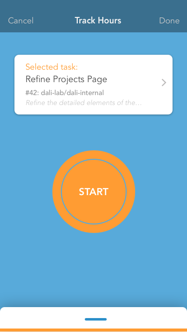

# ⏱ Git Clock

A timer app that associates time with GitHub issues to help you keep track of time spent on each.

## Designs


[Sketch design](https://sketch.cloud/s/MGvdz)

## Architecture
### Tech Stack 🥞
Using Xcode and Swift to develop an iOS app.

#### Packages 📦

- [FutureKit](https://github.com/FutureKit/FutureKit)
- [EmitterKit](https://github.com/aleclarson/emitter-kit)
- [Socket IO](https://github.com/socketio/socket.io-client-swift)
- [Alamofire](https://github.com/Alamofire/Alamofire)
- [SwiftyJSON](https://github.com/SwiftyJSON/SwiftyJSON)

### Style
Using standard DALI swift style guide and linter: [SwiftLint](https://github.com/realm/SwiftLint)

### File Structure

```
├──Git Clock/                 # Main code directory
|  └──App Delegate            # Initialization file
|  └──UI/                     # Code applying to the UI
|  └──GitHub/                 # Code applying to GitHub communication
|  └──Server/                 # Code for communicating to the server
├──Git Clock Tests/           # Unit Tests
├──Git Clock UI Tests/        # UI Tests
├──Git Clock.xcworkspace      # The workspace (OPEN THIS to get working)  
```

For more detailed documentation on our file structure and specific functions in the code, feel free to check the project files themselves.

## Setup Steps 
1. Clone repo by running `git clone https://github.com/dali-lab/git-clock.git` in your terminal
2. If you don't have Homebrew installed, [install it](https://brew.sh)
3. If you don't have Cocoapods installed, [install it](https://guides.cocoapods.org/using/getting-started.html) (`brew install cocoapods`)
4. In the project directory, run `pod install` to install the Cocoapods

## Acknowledgments 🤝
Thanks to Luisa Vasquez [@VLuisa](https://github.com/VLuisa) who thought up this idea and designed and refined the product.

---
Designed and developed by [@DALI Lab](https://github.com/dali-lab)